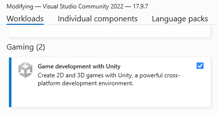

# Part 1: Setup

## Visual Studio
I highly recommend [Visual Studio 2022](https://visualstudio.microsoft.com/vs/community/). It's a free IDE and has built-in nuget package manager. This is where you'll build the actual mod's code and compile test builds. 

Then you want to select "Game development with Unity" from the installer.

I also recommend watching a few [Visual Studio videos](https://youtu.be/VcU2HGsxeII?si=Sut_UMkfBaPCdB-x&t=480) to jump-start knowing how to get around the software. 

### IDE Notes
I personally use both Visual Studio 2022 and [Visual Studio Code](https://code.visualstudio.com/download) while working on V Rising mods. Visual Studio is a full IDE and includes the tools needed to compile DLLs. To my knowledge, Visual Studio Code cannot compile DLLs as it is a glorified text editor; but Code is a much more ingrained piece of software in my workflow due to being a Unity developer. 

I know some other modders like to use [Rider](https://www.jetbrains.com/rider/) because it includes dnSpy. My recommendation is to start with Visual Studio 2022 and venture out to other options once you're comfortable.

## Git
Next you'll want to setup Git on your computer.

The more classical approach would be to install [Git](https://git-scm.com/downloads/win) directly and can follow the installer with default settings. 

Nowadays though people tend to prefer GUIs and getting [GitHub Desktop](https://desktop.github.com/download/) will both give you a GUI and install Git. 

[Learn more about Version Control here](https://product.hubspot.com/blog/git-and-github-tutorial-for-beginners). 

And if you wanna use version control in a professional manner, really utilize the power of Git, learn about [GitFlow](https://www.atlassian.com/git/tutorials/comparing-workflows/gitflow-workflow).

## Template
For this tutorial we'll be using VRising.ModTemplatePlus from nuget. Open a Command Prompt or [PowerShell window](https://stackoverflow.com/questions/183901/how-do-i-start-powershell-from-windows-explorer) in a folder you want to make your mods and use the following command to install the template.

`dotnet new install VRising.ModTemplatePlus`

That will install the template which you can use for this tutorial and for any future mod projects as well. 

Next we'll create the sample project by passing in the `-how` parameter to the template.

`dotnet new vrisingmodplus -n DiceRoller -how -desc "Sample Project"`

This will create a new project from the vrisingmodplus template with the name `Dice Roller`, the description `Sample Project`, and the how parameter will include some tutorial specific notes in the project. Once you finish this tutorial you should no longer need to include the how parameter. 

You can learn more about what the template can do at [text](../../template.md).

## Open the .sln in Visual Studio
You should now see a file titled `DiceRoller.sln`. Right click that and select Open with... Visual Studio 2022. 

That will load up the IDE with the DiceRoller project. Make your way over to the Plugin.cs file and we'll begin the next Part fo the tutorial there. 

Next [Part 2: What is Plugin?](01_sample_plugin.md)