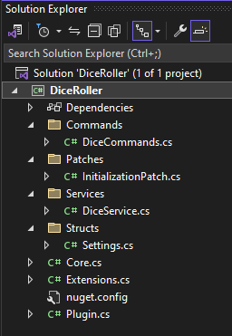

# Part 2: What is Plugin?
In this part we will explore the project generated by the Template and try to understand the general structure and components of a V Rising mod. 

You should have a matching Solution Explorer as the below image.



We will go over each folder and file, but we'll go in order that I typically would build them without a template. 

## Attributes & Variables
Plugin is the absolute center of your mod. It is the script that BepInEx uses to load the mod into the game. From top to bottom I'll explain what each part of the script does. 

```csharp
[BepInPlugin(MyPluginInfo.PLUGIN_GUID, MyPluginInfo.PLUGIN_NAME, MyPluginInfo.PLUGIN_VERSION)]
[BepInDependency("gg.deca.VampireCommandFramework")]
public class Plugin : BasePlugin
```

I won't be going into detail on what a [Class](https://learn.microsoft.com/en-us/dotnet/csharp/language-reference/language-specification/classes), [Struct](https://learn.microsoft.com/en-us/dotnet/csharp/language-reference/language-specification/structs), interface, or other types in C# are. You can pick up on that over time as you mod or can checkout some C# tutorials to learn more. 

The top two elements here BepInPlugin and BepInDependency are [Attributes](https://learn.microsoft.com/en-us/dotnet/csharp/language-reference/language-specification/attributes) that define how the BepInEx loader should define and handle our mod. 

Plugin GUID is the assembly name of our mod, you could change this if you wanted to be different than the assembly; but currently it is `DiceRoller`. 

As such Plugin Name will also be `DiceRoller`. There isn't much reason to have these difference unless you're building a framework and want to have library-like addresses for your guid (i.e. VampireCommandFramework).

Plugin Version defines the current [Semantic Version](https://www.geeksforgeeks.org/introduction-semantic-versioning/) of your mod. 1.0.0 for example is the default. As you update your mod this version will increase and inform user (and Thunderstore) to update. 

The second Attribute shown is BepInDependency. This tells BepInEx that your mod *must* be loaded after VampireCommandFramework in-order to function. You can also tell BepInEx that you want to load after specific mods but don't necessarily need them to be present with [DependencyFlag.SoftDependency](https://docs.bepinex.dev/master/api/BepInEx.BepInDependency.html). But that's a tad more advanced of a topic. 

```csharp
Harmony _harmony;
public static Plugin Instance { get; private set; }
public static Harmony Harmony => Instance._harmony;
public static ManualLogSource LogInstance => Instance.Log;
public static Settings Settings { get; private set; }
```

[Harmony](https://harmony.pardeike.net/articles/intro.html) is a patching library for .NET at runtime. This is what enables us to modify and augment the game's code to do different things. BepInEx is using a forked flavor of Harmony called `HarmonyX`. 

Plugin Instance is simply giving us a [Static](https://learn.microsoft.com/en-us/dotnet/csharp/language-reference/keywords/static) reference to our Plugin class that we can call anywhere in the application. 

You can see that both Harmony and LogInstance are being set to instances inside the Plugin static "Instance". 

ManualLogSource is the name of BepInEx's logging system. This will output information to the `LogOutpout.log` file at runtime. For example:

```
[Info   :CrimsonBanned] |CrimsonBanned[1.2.0] initialized|
[Info   :CrimsonClans] InitializeAfterLoaded completed
[Info   :CrimsonStyle] Loaded Styles Database: 3 entries
```

This is useful for all kinds of reason such as debugging, ensuring the mod is loading, and just general audit information. 

And lastly there is Settings, we will return to this in a future part soon, but for now just know that it is the container & generator for the BepInEx Config for the mod. 

## What is Load()
So imagine BepInEx is going through each mod one-by-one. It needs instruction on what to do when it reaches your mod. Load is that instruction, it is all the elements required to get your mod initially loaded. Now there are instances where you don't want to initialize everything about your mod at this point; as the server does not exist yet fully. We'll get into that more with Core.cs. 

```csharp
public override void Load()
{
    Instance = this;
    Settings = new Settings();
    Settings.InitConfig();

    Log.LogInfo($"Plugin {MyPluginInfo.PLUGIN_GUID} version {MyPluginInfo.PLUGIN_VERSION} is loaded!");

    // Harmony patching
    _harmony = new Harmony(MyPluginInfo.PLUGIN_GUID);
    _harmony.PatchAll(System.Reflection.Assembly.GetExecutingAssembly());

    // Register all commands in the assembly with VCF
    CommandRegistry.RegisterAll();
}
```
Learn about [void](https://learn.microsoft.com/en-us/dotnet/csharp/language-reference/builtin-types/void) here. Learn about [override](https://learn.microsoft.com/en-us/dotnet/csharp/language-reference/keywords/override) here.

Code is executed top to bottom, so here we can see the first thing we do is set our Instance variable from above to [this](https://learn.microsoft.com/en-us/dotnet/csharp/language-reference/keywords/this) instance of Plugin.

Then we create a new instance of our Settings script and call the InitConfig method from it. Again we'll go into detail about what this is doing later. 

We then call our ManualLogSource and output to the log that our mod was loaded. 

Then we are setting up Harmony for our mod by passing in an identifier (our GUID) and telling it to patch all of the assemblies in our project (everything in the `Patches` folder in this instance).

You can also specify specific things to Patch and Unpatch as well, but again that's a tad more advanced of a topic that we won't be going into deeply in this tutorial. 

Lastly you'll see the CommandRegistry.RegisterAll method call. This is to the VampireCommandFramework telling it to load all the commands in the project (everything in the `Commands` folder in this instance). 

## What is Unload()
Like Load, we also need to tell BepInEx what to do when we Unload the mod (the server shuts down or the game closes).

```csharp
public override bool Unload()
{
    CommandRegistry.UnregisterAssembly();
    _harmony?.UnpatchSelf();
    return true;
}
```
This is rather straightforward. We unregister our commands from VCF (VampireCommandFramework) and unpatch from Harmony. Then we return true to tell BepInEx that we've succeeded in unloading. 

Next [Part 2: What are ECSExtensions?](02_sample_ecs.md)